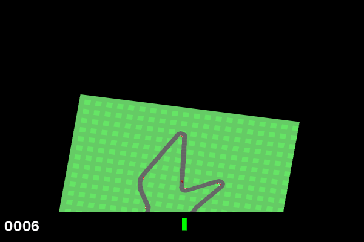

# Entwicklung und Evaluation eines DDQN-Agenten in der Gym-Umgebung CarRacing-v3

**Autor:** Niklas Dziwisch  
**Umgebung:** `CarRacing-v3` (Gymnasium)  
**Frameworks:** PyTorch, Gymnasium, Plotly

Dieses Projekt zeigt die Entwicklung, das Training und die Auswertung eines Reinforcement-Learning-Agenten auf Basis von **Double Deep Q-Networks (DDQN)** zur autonomen Steuerung eines Fahrzeugs in der Umgebung `CarRacing-v3`.

Der Agent nutzt unter anderem:
- FrameStacking und Bildvorverarbeitung (Graustufen, Resize auf 84×84)
- Experience Replay und Soft Target Updates (Polyak Averaging)
- Huber Loss zur Stabilisierung
- Diskrete Aktionsquantisierung für kontinuierliche Steuerung

## Projektstruktur

In den Ordner `car_racing_rl/` befinden sich folgende Dateien und Ordner:

`requirements.txt`: Python Packete und Bibliotheken

`car_racing_ddqn.ipynb`: Jupyter Notebook mit Modellaufbau, Training, Visualisierung & Analyse 

`test_agent.py`: Skript zum Testen des trainierten Agenten

`trained_agent.pth`: Gespeicherter Agent nach dem Training

`model_checkpoints/checkpoint_episode_{episonden_nummer}.pth`: Gespeicherte Agenten alle 100 Episoden

## Setup & Ausführung

### 1. Virtuelle Umgebung einrichten (empfohlen)
```bash
python -m venv venv
source venv/bin/activate      # macOS (oder Linux)
venv\Scripts\activate         # Windows
```

### 2. Packete installieren

```bash
pip install -r requirements.txt
```

### 3. Notebook starten

Über "Run" oder:

```bash
jupyter notebook car_racing_ddqn.ipynb
```

mit den ausgewählten virtual Environment oder Kernel.

## Visualisierungen

Im Ordner `car_racing_rl/img/` befinden sich:

`final_plot_combined.png`: Kombinierte Visualisierung in einem Bild

`reward_plot.png`: Visualisierung des Verlaufes der Belohnung

`loss_plot.png`: Visualisierung des Verlaufes des Verlustes

`epsilon_plot.png`: Visualisierung des Verlaufes des Epsilon Wertes über die Zeit

### Demo des Agenten beim Fahren



Agent in Action (simuliert durch das Python Skript in `test_agent.py`)

## Hinweise

Dieses Projekt entstand im Rahmen einer universitären Aufgabe zum Thema Reinforcement Learning.

Die Implementierung basiert vollständig auf den offiziellen Dokumentationen von [Gymnasium](https://gymnasium.farama.org/environments/box2d/car_racing/) und [PyTorch](https://pytorch.org/docs/stable/index.html) sowie den vermittelten Inhalten der Vorlesung von Janina Patzer. Der gesamte Code wurde eigenständig entwickelt.

Bei auftretenden Fehlern und Warnungen diente ChatGPT und GitHub Copilot unterstützend als Debugging-Hilfe.

Der Code ist modular aufgebaut, umfassend dokumentiert und kann gerne als Grundlage für ähnliche Projekte verwendet werden.

Für Rückfragen oder Anmerkungen: **niklas.dziwisch@sap.com**
